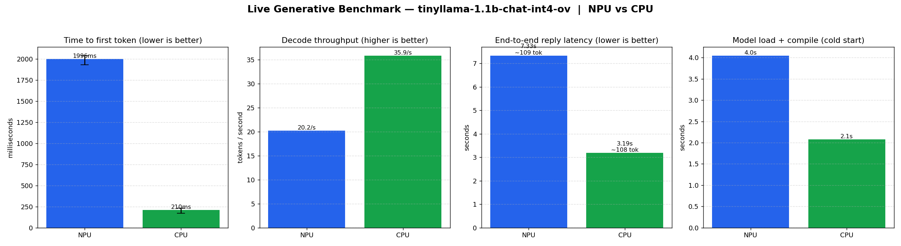
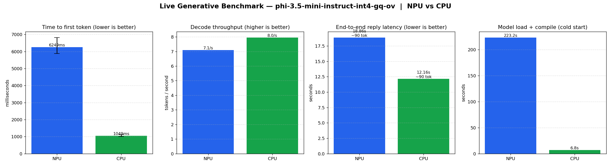
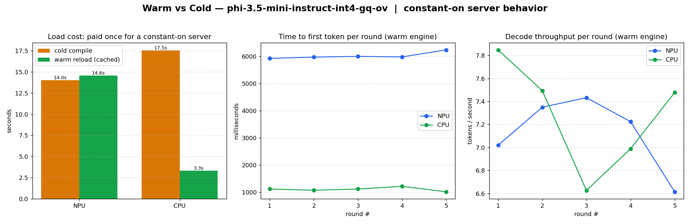
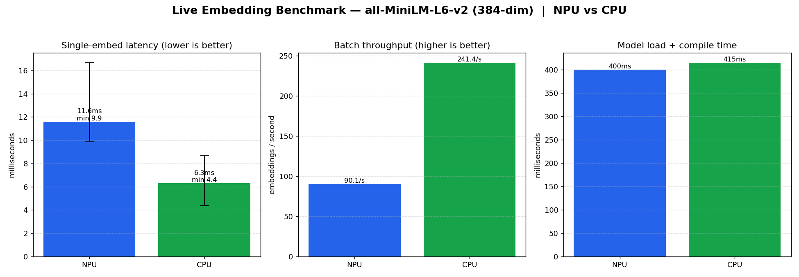

# NPU vs CPU Benchmark Results

Live, on-hardware measurements comparing the Intel NPU against the CPU for the
two workloads this proxy serves: **text embedding** and **text generation**.

> These are real numbers from a single machine. Hardware, OpenVINO version,
> model export, and compile-cache state all move the results. Treat them as
> directional guidance, not guarantees. Reproduce locally with the scripts
> referenced in [Methodology](#methodology).

## Test environment

| Component | Value |
|---|---|
| CPU | Intel Core Ultra 7 165H (Meteor Lake) |
| NPU | Intel AI Boost NPU (integrated) |
| OpenVINO | 2026.2.0 |
| Python | 3.12 (project `uv` virtualenv) |
| OS | Windows 11 |
| Devices seen | `CPU`, `GPU.0`, `GPU.1`, `NPU` |

Real device access requires `NPU_PROXY_REAL_INFERENCE=1`; the default mock mode
reports only `CPU`.

## TL;DR

- For the **small models that actually compile on this NPU**, the **CPU is
  faster** on both embedding and generation.
- The NPU pays a large **time-to-first-token** penalty on generation (~1.5–2 s
  prefill vs ~0.2 s on CPU) and delivers **lower decode throughput** (~20 tok/s
  vs ~36 tok/s on TinyLlama).
- **Not every OpenVINO model export compiles on the NPU.** `bge-small`
  (embedding) and `mistral-7b-int4` (generation) both fail NPU compilation on
  this stack and fall back to CPU. The decisive factor is the **export recipe**,
  not the model size: a 3.8B **Phi-3.5-mini** exported with the documented NPU
  recipe (`INT4_SYM`, `group_size 128`, `ratio 1.0`) compiles and runs cleanly,
  while the older `mistral-7b-int4` export does not.
- The NPU's value here is **offload and power efficiency** (freeing the CPU/GPU
  for other work), not raw latency on lightweight models.

## Generation (the hot path)

Model: **TinyLlama 1.1B Chat (INT4, OpenVINO)** — the generative model in our
cache that compiles cleanly on the NPU. 3 chat-style prompts, `max_new_tokens=128`,
greedy decoding (`temperature=0`), warm pipeline. Per-token timing captured via a
streaming callback.



| Metric | NPU | CPU | Winner |
|---|---|---|---|
| Time to first token | ~1,575–1,996 ms | ~190–210 ms | **CPU** (~9x) |
| Decode throughput | ~20–23 tok/s | ~36–43 tok/s | **CPU** (~1.8x) |
| End-to-end (~108 tok reply) | ~6.3–7.3 s | ~2.7–3.2 s | **CPU** (~2.3x) |
| Load + compile (warm cache) | ~2–4 s | ~2 s | ≈ tie |

The dominant gap is **prefill / TTFT**: the NPU is slow to process the prompt
before the first token appears, which is exactly the latency a chat user feels.

### Larger model: Mistral 7B INT4

`mistral-7b-int4-ov` **fails to compile on the NPU** on this stack:

```
StopLocationVerifierPass Pass failed : Found 304 duplicated names
Compiler returned: ZE_RESULT_ERROR_INVALID_NULL_POINTER
```

It falls back to CPU, where a 7B INT4 model runs at roughly **7 tok/s** with
~1 s TTFT — usable but slow. The failure is the **export**, not the family:
OpenVINO publishes a correct NPU export (`OpenVINO/Mistral-7B-Instruct-v0.3-int4-cw-ov`)
in its [LLMs-optimized-for-NPU collection](https://huggingface.co/collections/OpenVINO/llms-optimized-for-npu-686e7f0bf7bc184bd71f8ba0).

### NPU-validated model: Phi-3.5-mini (INT4-GQ)

To test a model **known** to work on the NPU, we pulled
`OpenVINO/Phi-3.5-mini-instruct-int4-gq-ov` from Intel's official
[LLMs-optimized-for-NPU collection](https://huggingface.co/collections/OpenVINO/llms-optimized-for-npu-686e7f0bf7bc184bd71f8ba0).
It is a 3.8B model exported with the documented NPU recipe (`INT4_SYM`,
`group_size 128`, `ratio 1.0`). Same harness: 3 chat prompts,
`max_new_tokens=128`, greedy decode, warm pipeline.



| Metric | NPU | CPU | Winner |
|---|---|---|---|
| Time to first token | ~6,249 ms | ~1,049 ms | **CPU** (~6x) |
| Decode throughput | ~7.1 tok/s | ~8.0 tok/s | **CPU** (~1.1x) |
| End-to-end (~90 tok reply) | ~18.9 s | ~12.2 s | **CPU** (~1.6x) |
| Load + compile (cold) | ~223 s | ~7 s | **CPU** |

The headline result: **the model compiles and runs on the NPU** — confirming the
search found a genuinely NPU-compatible export. But on this Meteor Lake (Series 1)
silicon the **CPU is still faster** on every metric, and decode throughput is now
*close* (7.1 vs 8.0 tok/s) only because a 3.8B model also strains the CPU. The
NPU's cold compile (~3.7 min) is steep and again the TTFT/prefill gap dominates.
Intel's own model card validates this export against Core Ultra **Series 2/3**
NPUs; on Series 1 it works but does not win.

### Warm vs cold: a constant-on server pays compile once

The ~223 s figure above is alarming, but it is a **one-time, first-ever** cost.
A real deployment keeps the model loaded, so we re-ran Phi-3.5-mini keeping the
engine resident and measured five back-to-back inference rounds per device.



| Aspect | NPU | CPU |
|---|---|---|
| First-ever cold compile | ~223 s (once, ever) | — |
| Reload in a fresh process | ~14 s | ~17.5 s → **3.3 s** (OpenVINO `CACHE_DIR`) |
| Steady-state TTFT (rounds 1–5) | ~6.0 s (flat) | ~1.1 s (flat) |
| Steady-state decode (rounds 1–5) | ~7.2 tok/s | ~7.1 tok/s |

Three takeaways:

- **The big compile is paid once.** After the first-ever compile, the Intel NPU
  driver caches the compiled kernels itself, so later process loads are ~14 s —
  about **16x faster** than the initial cold compile. (Our explicit
  `compile_cache_dir`/`CACHE_DIR` did not speed the NPU further, since the driver
  already caches, but it cut **CPU** load ~5x.)
- **Warmth does not change per-request speed.** Round 1 already matches rounds
  2–5: NPU TTFT holds ~6 s and decode ~7 tok/s with no ramp-up. The
  time-to-first-token cost is **structural prefill**, not a warmup artifact.
- **On this 3.8B model NPU decode ties the CPU** (7.2 vs 7.1 tok/s). The entire
  user-visible gap is TTFT — the CPU starts replying ~5.5x sooner.

So keeping the NPU "always on" erases the scary startup number but does not make
individual replies faster; for low-latency chat the CPU still wins on this
Meteor Lake hardware.

## Embedding

Model: **all-MiniLM-L6-v2** (384-dim) — the embedding model with a validated NPU
static-shape preset. 30 single-embed iterations + an 8-item batch, warm pipeline.



| Metric | NPU | CPU | Winner |
|---|---|---|---|
| Single-embed latency (mean) | ~11.6 ms | ~6.3 ms | **CPU** (~1.8x) |
| Batch throughput (x8) | ~90 emb/s | ~241 emb/s | **CPU** (~2.7x) |
| Load + compile | ~400 ms | ~415 ms | ≈ tie |

Embeddings are tiny, bursty units of work — too short for the NPU's throughput
advantage to amortize its per-call overhead.

## Model compatibility findings

| Model | Type | NPU compile | Notes |
|---|---|---|---|
| all-MiniLM-L6-v2 | embedding | ✅ | Needs static-shape preset (batch=1, max_len=256) |
| BAAI/bge-small-en-v1.5 | embedding | ❌ | `check_sdpa_nodes failed`; use hash fallback or CPU |
| TinyLlama 1.1B INT4 | generation | ✅ | Compiles and runs on NPU |
| Phi-3.5-mini 3.8B INT4-GQ | generation | ✅ | Intel-published NPU export (`INT4_SYM`, GQ-128); runs, CPU still faster |
| Granite 4 Micro | generation | ✅ (downloaded) | Not benchmarked here |
| Mistral 7B INT4 (local export) | generation | ❌ | `StopLocationVerifierPass` duplicate-names failure |

The recurring lesson: **NPU support is per-model-export, not per-model-family.**
Validate each export before assuming the NPU can run it, and prefer the exports
in Intel's [LLMs-optimized-for-NPU collection](https://huggingface.co/collections/OpenVINO/llms-optimized-for-npu-686e7f0bf7bc184bd71f8ba0),
which use the required `--sym --weight-format int4 --group-size 128|-1 --ratio 1.0`
recipe. (`NF4` exports need a Lunar Lake / Series 2 NPU and won't help on the
165H.)

## Practical guidance

- **Default small embedders and small chat models to CPU** for lowest latency.
- **Reserve the NPU** for cases where you specifically want to *offload* work
  from a busy CPU/GPU or care about sustained power efficiency, not p50 latency.
- **Certify every model on the NPU** before relying on it (see
  `scripts/certify_npu.py`); expect some exports to fail compilation and fall
  back.
- Keep the **compile cache** warm — cold NPU compilation can cost tens of
  seconds to minutes on first load.

## Methodology

Two standalone scripts produced these numbers (run from the repo root in the
project `uv` venv, with `NPU_PROXY_REAL_INFERENCE=1`):

- **Generation** — loads each device's `InferenceEngine`, warms it, then times
  TTFT and per-token decode rate via a streaming callback (independent of
  engine-reported `perf_metrics`, which this OpenVINO build leaves unpopulated).
- **Embedding** — loads `ProductionEmbeddingEngine` per device and measures
  single-embed latency (mean/median/p95) plus batch throughput.

Both render the charts shown above. For repeatable JSON artifacts and
device-to-device comparison, see the benchmark CLI in
[`BENCHMARKS.md`](BENCHMARKS.md) (`scripts/benchmark.py`).
